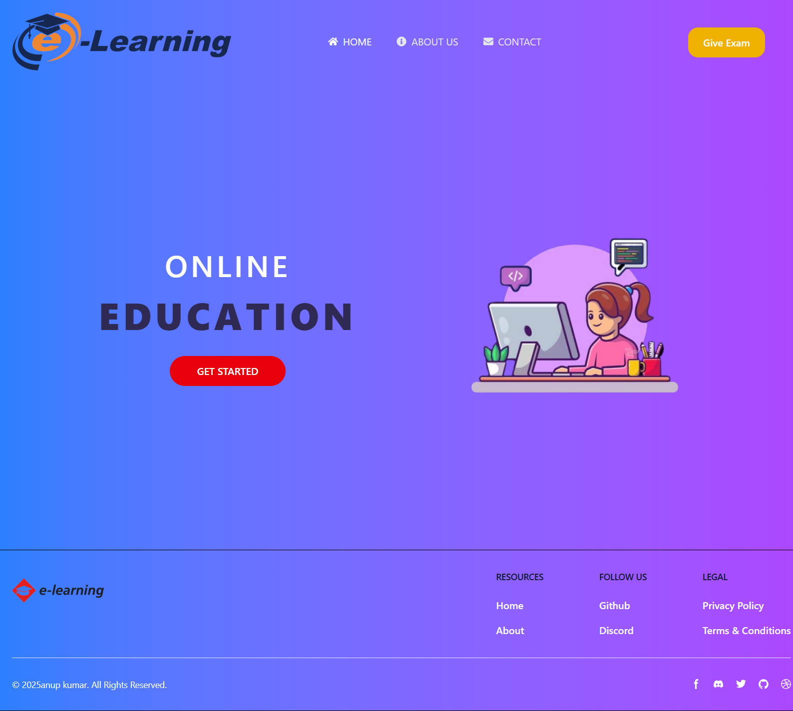
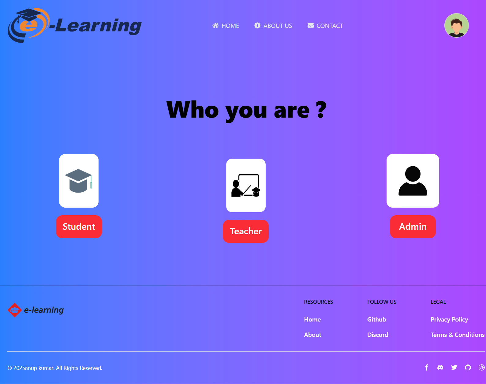
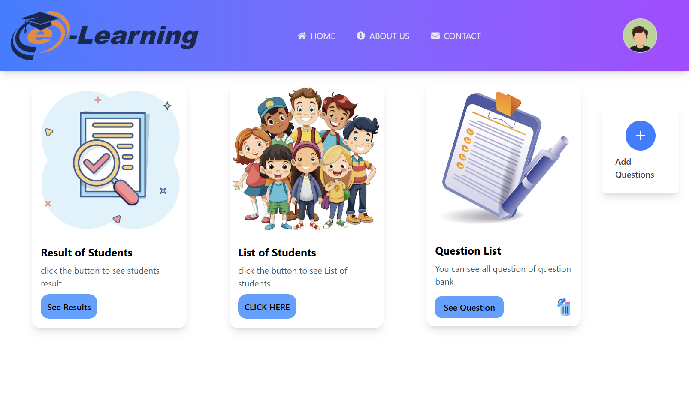

# E-Learning Platform with Role-Based Authentication

This project is an **E-Learning platform** built with **Spring Boot** (Backend) and **React** (Frontend).  
It features **role-based authentication** for **Students**, **Teachers**, and **Admins**.  

---

## Features

- **Role-Based Authentication** (Student, Teacher, Admin)
- **JWT Security** for API protection
- **React Frontend** with dynamic routing based on roles
- **Student** can take exams
- **Teacher** can manage questions and view student performance
- **Admin** can manage users and system data

---

## Tech Stack

- **Backend:** Spring Boot, Spring Security (JWT)
- **Frontend:** React, Axios
- **Database:** (MySQL/PostgreSQL)
- **Build Tool:** Maven (Spring Boot), Vite (React)

---

## Screenshots

### Home Page


### Role Selection Page


### Student Dashboard


### Teacher Dashboard


---

## Getting Started

### Backend
1. Clone the backend repository.
2. Configure `application.properties` for database and JWT secret.
3. Run the Spring Boot application.

### Frontend
1. Navigate to the React project folder.
2. Install dependencies:
   ```bash
   npm install
